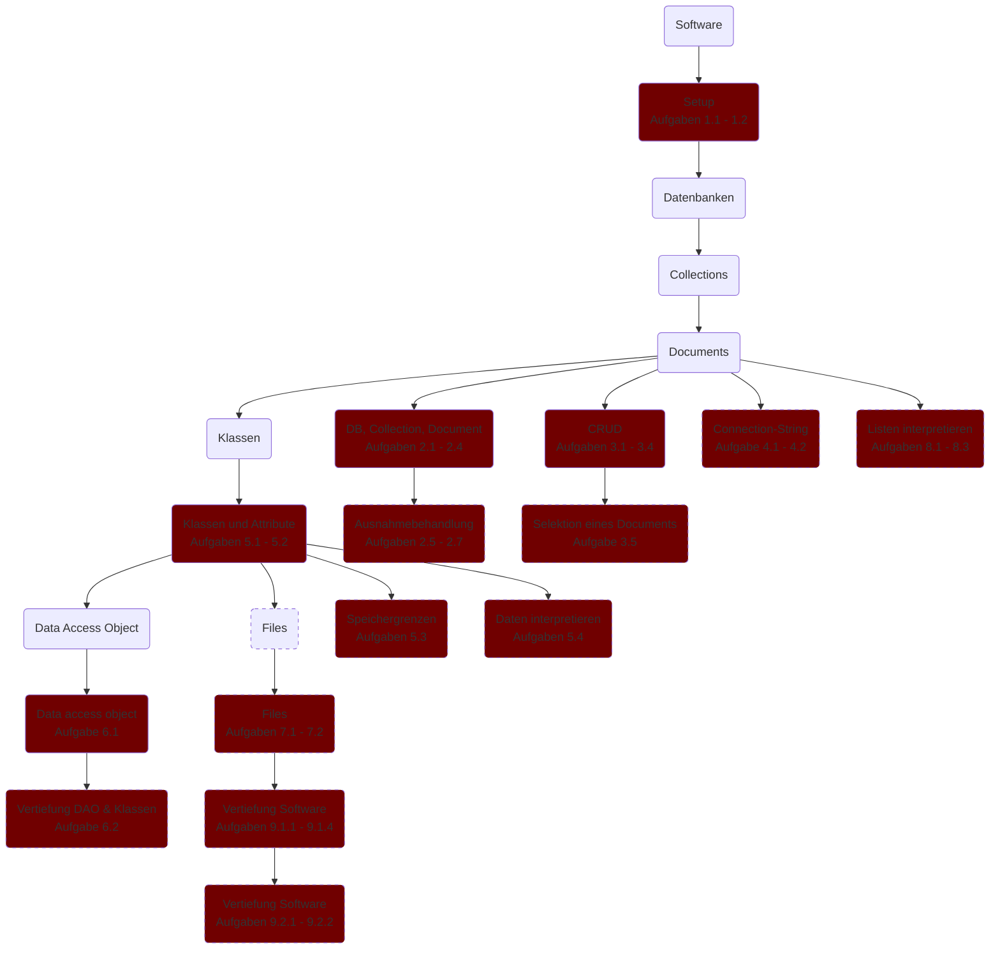
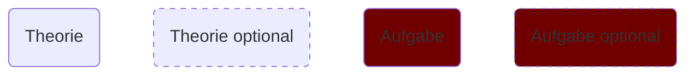

# Aufgaben

## Leitfaden

Theorie und Aufgaben in diesem Kapitel können teilweise freiwillig verarbeitet werden. Die untenstehende Übersicht zeigt Abhängigkeiten zwischen Theorien und Aufgaben. 



Legende


## 1. Setup

1. Erkläre die Abkürzung ODM und welche Funktion ODM wahrnimmt. 

1. Richte dein System so ein, dass du über Python oder C# eine Verbindung zur Datenbank herstellen kannst.\
    Erstelle dazu ein kleines Testprogramm. 


## 2. DB, Collection, Document

Erstelle eine Applikation, die als Datenbank / Collection und Document Explorer funktioniert. 

1. Wenn die Applikation gestartet wird, werden alle Datenbanken nach diesem Muster aufgelistet: 
    ```console
    Databases
     - db1
     - db2
     - db3

    Select Database: 
    ```

1. Eine Datenbank kann selektiert werden, indem ihr Name eingegeben wird. Nach der Eingabe wird der Name der gewählten Datenbank und alle enthaltenen Collections angezeigt: 
    ```console
    <db_name>

    Collections
     - col1
     - col2
     - col3

    Select Collection: 
    ```
1. Eine Collection kann selektiert werden, indem ihr Name eingegeben wird. Nach der Eingabe wird der Name der Datenbank, der Collection und alle IDs der enthaltenen Documents angezeigt: 
    ```console
    <db_name>.<col_name>

    Documents
     - 63dd4f4
     - 63dd4f5
     - 63dd4f6

     Select Document: 
     ```
1. Ein Document kann selektiert werden, indem seine ID eigegeben wird. Nach der Eingabe wird der Name der Datenbank, der Collection und der Inhalt des gewählten Documents angezeigt: 
    ```
    <db_name>.<col_name>.<id>
    
    content1: example
    content2: 605

    Press any button to return
    ```
1. Der Text **Press any button to return** wird in zwei Situationen angezeigt: 
    - Der Inhalt eines Documents wird angezeigt.
    - Ein gewähltes Element hat keinen Inhalt (Bsp.: In einer Collection existiert kein Document). 

    In beiden Fällen startet nach einem Tastendruck die Applikation von vorne. 
1. Wenn kein anzuzeigendes Element (Datenbank, Collection, Document) vorhanden ist, wird dies angezeigt. Hier beispielsweise bei einer Datenbank: 
    ```
    No Database
    ``` 
1. Sollte vom User etwas (Datenbank, Collection, Document) gewählt werden, was nicht vorhanden ist, wird eine Meldung ausgegeben. Der User kann nochmals wählen. 


## 3. CRUD

Die folgenden Aufgaben beziehen sich auf die [Restaurant-Datenbank](../../backup/task/_index.files/db_restaurants.zip), welche in einem vorgängigen Kapitel importiert wurde. 

1. Die Restaurants befinden sich in Stadtbezirken. Alle Stadtbezirke sollen ausgegeben werden, jedoch nicht doppelt. 

1. Es sollen die top 3 Restaurants ausgegeben, welche im Durchschnitt das höchste Rating (score) haben. 
1. Finde das Restaurant, welches geografisch am nächsten zum Restaurant mit dem Namen **Le Perigord** liegt. 
1. Erstelle eine Applikation, mit welcher ein Restaurant gesucht werden kann. 
    - Es soll nach den Attributen **Name** und **Küche** gesucht werden können. 
    - Die Suche der Attribute ist optional: Wird ein Attribut für die Suche leer gelassen, wird es ignoriert. 
    - Ein teilweise übereinstimmender Suchbegriff (Bsp.: **Steakhouse**) liefert alle Restaurants, welche den Begriff beinhalten. 
1. Ergänze die Applikation aus der vorhergehenden Aufgabe. Einem gesuchten Restaurant kann eine Bewertung vergeben werden. 
    - Liefert die Suche mehrere Restaurants als Ergebnis, kann eines ausgewählt werden. Dabei soll die *ID* des Documents im Programm gespeichert werden.  
    - Die Bewertung wird mit dem aktuellen Datum versehen und dem Document ergänzt. 
 

## 4. Connection-String

Im Connection-String sind Zugangsdaten zur Datenbank enthalten. Der Connection-String soll aus sicherheitstechnischen Gründen nicht im Source Code, sondern in einer Umgebungsvariable gespeichert werden. 

1. Recherchiere, wie in Python oder C# Umgebungsvariablen gelesen werden können.\
    Erstelle ein Programm, welches exemplarisch den Inhalt der Umgebungsvariable **PATH** ausliest und ausgibt. 

1. Speichere den Connection-String in einer Umgebungsvariable und stelle mit einer Testsoftware eine Verbindung zur Cloud Datenbank her. 


## 5. Power Statistic

Mit der Python Library `psutil` kann die Auslastung von CPU und RAM angezeigt werden. Bei C# gibt es für diesen Zweck das NuGet-Paket `Hardware.Info`.

1. Erstelle eine Klasse mit dem Namen `Power`, welche diese Attribute speichert: 
    - CPU (in Prozent)
    - RAM total
    - RAM in Verwendung
    - Zeitstempel
   
   Achte darauf, dass der Zeitstempel und die Messungen von CPU und RAM nur dann erstellt werden muss, wenn dem Konstruktor keine Werte übergeben werden. 
1. Die aktuelle Auslastung von CPU und RAM (total + in Verwendung) werden im Sekundentakt in der Datenbank abspeichert. 
1. Die Applikation soll selbständig dafür sorgen, dass nicht mehr als 10000 Logs vorhanden sind. Sobald mehr als 10000 Logs gespeichert sind, werden die ältesten Logs gelöscht, sodass nur noch 10000 Logs vorhanden sind. 
1. Erstelle eine zusätzliche Applikation, welche die Daten in einem Graph anzeigt. Nutze dazu für Python die Library `matplotlib` und für C# das NuGet-Paket `OxyPlot.WindowsForms`.


## 6. DAO

1. Ergänze die Klasse `Dao_room` aus diesem [Beispiel](/m165/software/dao) um die Methoden `update` und `delete`. 

1. Erstelle eine Datenbank, in welcher Jokes gespeichert werden. 
    1. Entwirf die Klasse mit diesen Attributen: 
        - `text`: Text des Jokes. 
        - `category`: Liste von Kategorien welcher der Joke zugehörig ist. 
        - `author`: Verfasser des Jokes. 

    1. Erstelle die DAO-Klasse mit diesen Methoden: 
        - `insert`: Neuer Witz kann hinzugefügt werden
        - `get_category`: Die Kategorie kann als Parameter übergeben werden. Alle Witze dieser Kategorie werden zurückgegeben. 
        - `delete`: Die ID des zu löschenden Jokes wird übergeben. Die Methode löscht den Joke. 


## 7. Files

1. Nutze den Code aus dem [Beispiel](/m165/software/files), um ein File zu speichern und wieder herzustellen. 
    1. Beobachte die erstellten Collections in der Datenbank. 
    1. Zu einem File werden mehrere Documents angelegt. Wie wird die Verbindung der einzelnen Documents zueinander hergestellt. 
    1. In welcher Codierung werden die Rohdaten des Files gespeichert? 

1. Erstelle eine Applikation, welches Bilder als Fotoalbum speichert. Jedes Bild enthält als Metadaten die Information, zu welchem Album das Bild gehört. 
    1. Finde mit Hilfe der [Dokumentation](https://www.mongodb.com/docs/manual/core/gridfs/) heraus, wie Metadaten mit `GridFS` zu einem File gespeichert werden können. 
    1. Neue Fotos können einem beliebigen Fotoalbum hinzugefügt werden. 
    1. Fotos eines Fotoalbums können aus der Datenbank heruntergeladen werden. 


## 8. Listen interpretieren

Die folgenden Aufgaben beziehen sich auf die [Restaurant-Datenbank](../../backup/task/_index.files/db_restaurants.zip), welche in einem vorgängigen Kapitel importiert wurde. 

Die Restaurant-Datenbank verfügt über eine zweite Collection mit dem Namen **neighborhoods**. Die gespeicherten Documents enthalten Koordinaten, welche durch Verbindungen ein Polygon darstellen.

Es soll eine Applikation erstellt werden, welche die Polygone grafisch darstellt. 

1. Mit Hilfe der Python Library **Pillow** kann ein Bild gezeichnet werden. Bei C# gibt es für diesen Zweck das NuGet-Paket `System.Drawing`. Analysiere dazu diesen Code:



{}
```python
from PIL import Image, ImageDraw

im = Image.new(mode="RGB", size=(200, 200))

draw = ImageDraw.Draw(im)
draw.line((100, 200, 150, 180), fill=0x00ffff, width=3)

im.show()
```
{}

{}
```csharp
using System;
using System.Drawing;
using System.Windows.Forms;

var img = new Bitmap(200, 200);

using (var g = Graphics.FromImage(img))
{
    g.Clear(Color.White);
    g.DrawLine(new Pen(Color.Cyan, 3), 100, 200, 150, 180);
}

var form = new Form { ClientSize = new Size(200, 200) };
form.Controls.Add(new PictureBox { Dock = DockStyle.Fill, Image = img });

Application.Run(form);
```
{}



2. Lies die in der Collection **neighborhoods** gespeicherten Koordinaten eines einzelnen Polygons ein und stelle es als Bild dar. 
3. Lies die in der Collection **neighborhoods** gespeicherten Koordinaten aller Polygone ein und stelle sie als einzelnes Bild dar. 


## 9. Jukebox

Mit Python oder C# soll eine Jukebox programmiert werden, welche Audiofiles speichert und abspielt. Die Jukebox besteht aus zwei Softwares:
- Management: Hinzufügen, Ändern und Löschen von gespeicherten Musikstücken
- Player: Suchen von Musikstücken, Stücke in einer Playlist hinzufügen, Spielen der Playlist

### 9.1 Management

Beim Hinzufügen eines Songs muss mindestens ein **Name** für das Stück und ein **Interpret** angegeben werden. Optional können **Album**, **Genre** und **Erscheinungsjahr** angegeben werden. 

1. Erstelle eine Klasse für die Songs und wähle geeignete Attribute. 

1. Programmiere das Feature, dass ein Song in der Datenbank gespeichert werden kann. 
1. Ergänze das Feature, dass ein Song aus der Datenbank geändert werden kann. Dazu muss der Song gesucht und angewählt werden können. 
1. Ergänze das Feature, dass ein Song aus der Datenbank gelöscht werden kann. Dazu muss der Song gesucht und angewählt werden können. 

### 9.2 Player

1. Der Player bietet Suchfunktionen für Name, Interpret, Album und Genre an. Die Suchfunktion arbeitet nach diesem Algorithmus:
    1. Gross-/Kleinschreibung wird ignoriert. 

    1. Songs werden auch dann aufgelistet, wenn nur ein Teil des Suchbegriffs übereinstimmt. Beispiel: Suche nach **the Wall** findet auch **Another Brick in the Wall**. 
    1. Suchparameter können kombiniert werden. Beispiel: Suche nach Interpret **Beatles** und Name **Back** findet unter anderem **Get Back** und **I'll Be Back**. 

1. Ein gefundener Song kann der Playlist hinzugefügt werden. Die Songs werden in der Reihe abgespielt, wie sie eingefügt wurden (*first in first out*).\
Sollte sich kein Song in der Playliste befinden, wird ein zufälliger Song abgespielt. 
